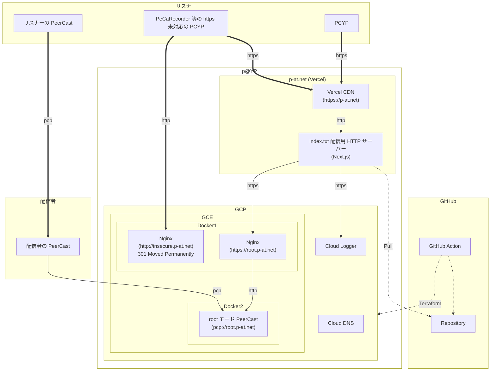
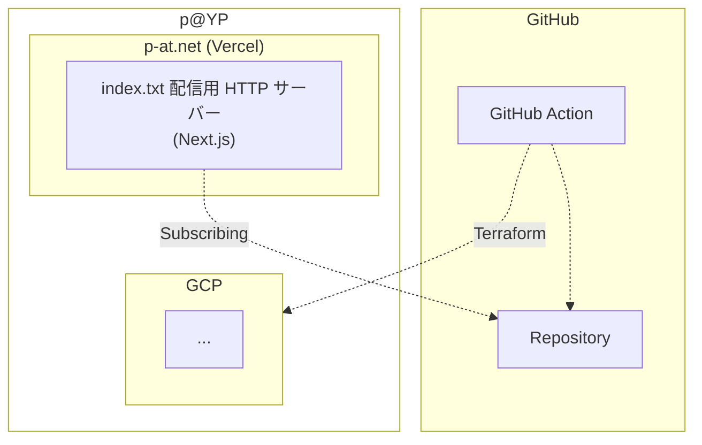

## サーバー構成

```mermaid
flowchart TD

subgraph "リスナー"
  listener
  browser
  pecareco
end

subgraph "配信者"
  broadcaster
end

subgraph "GitHub"
  Repository
  gha -.-> Repository
end

style pat fill:#0000
subgraph pat["p@YP"]
  subgraph vercel["p-at.net (Vercel)"]
    isr["Vercel CDN<br>(https://p-at.net)"]
    www["index.txt 配信用 HTTP サーバー<br>(Next.js)"]
  end

  subgraph GCP
    direction TB
    subgraph GCE
      subgraph docker1["Docker1"]
        nginxinsecure["Nginx<br>(http://insecure.p-at.net)<br>301 Moved Permanently"]
        nginxroot["Nginx<br>(https://root.p-at.net)"]
      end
      subgraph docker2["Docker2"]
        root["root モード PeerCast<br>(pcp://root.p-at.net)"];
      end
    end
    dns["Cloud DNS"]
    logger["Cloud Logger"]
  end
end

listener["リスナーの PeerCast"]==pcp==>broadcaster
broadcaster["配信者の PeerCast"]--pcp-->root
pecareco["PeCaRecorder 等の https 未対応の PCYP"]==http==>nginxinsecure
pecareco==https==>isr
browser["PCYP"]==https==>isr
isr--http-->www;
www--https-->logger
www--https-->nginxroot;
nginxroot--http-->root;

gha["GitHub Action"] -."Terraform".-> GCP
www -.Pull.-> Repository
```

## デプロイ構成

```mermaid
flowchart TD

subgraph "GitHub"
  Repository
  gha -.-> Repository
end

style pat fill:#0000
subgraph pat["p@YP"]
  subgraph vercel["p-at.net (Vercel)"]
    www["index.txt 配信用 HTTP サーバー<br>(Next.js)"]
  end
  subgraph GCP
    ...
  end
end

gha["GitHub Action"] -."Terraform".-> GCP
www -.Subscribing.-> Repository
```
