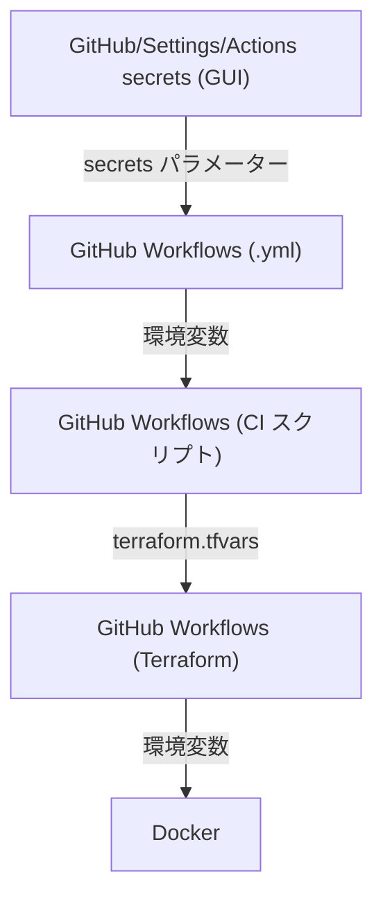

## 環境変数の流れ



## ビルド

```
$ docker build --tag progre/pp-init:latest --file Dockerfile.init . && \
  docker build --tag progre/pp-peercast:latest --file Dockerfile.peercast . && \
  docker build --tag progre/pp:latest .
$ docker push progre/pp-init:latest && \
  docker push progre/pp-peercast:latest && \
  docker push progre/pp:latest
$ terraform init
$ terraform apply -var-file="main.tfvars" -auto-approve
```

```
$ terraform destroy -var-file="main.tfvars" -auto-approve
$ docker run -it \
  --volume /var/run/docker.sock:/var/run/docker.sock \
  --env ROOT_DOMAIN=localhost \
  --env INSECURE_DOMAIN=localhost2 \
  --env EMAIL_ADDRESS=hoge@example.com \
  --env PASSWORD=hoge \
  progre/pp:latest
```

VM の再構築
```
$ terraform taint -var-file="main.tfvars" google_compute_instance.tf-cloud-01
$ terraform apply -var-file="main.tfvars" -auto-approve
```

pcp://root.p-at.net
https://p-at.net/index.txt
